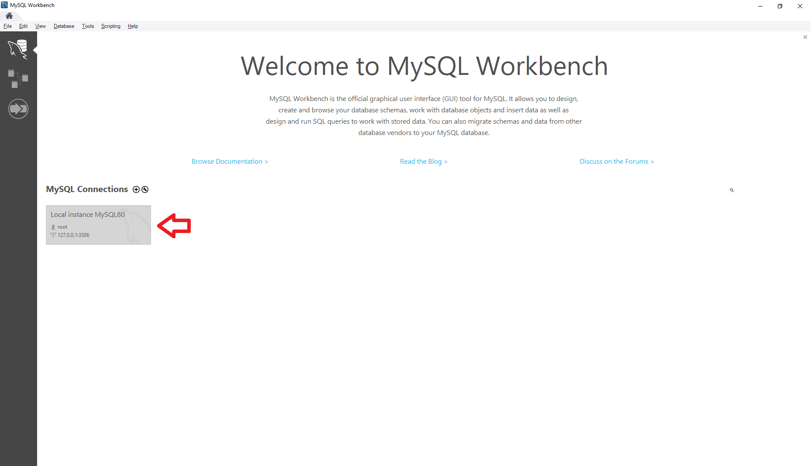
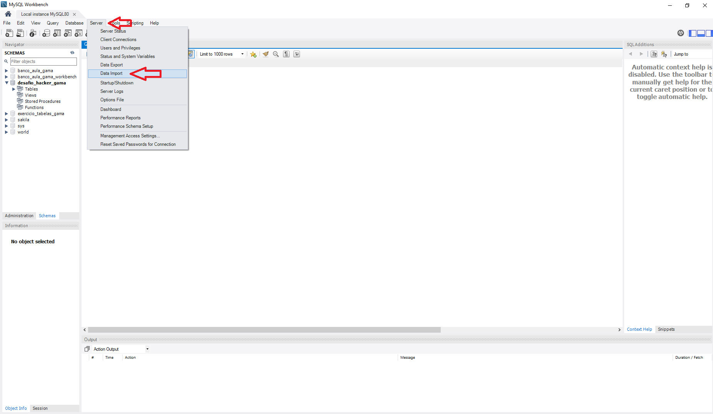
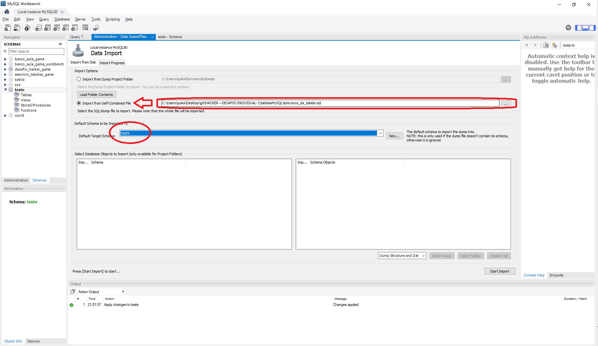

<b><h1>Desafio Hacker Gama parte 3</b></h1>
<h2>Relação de arquivos:</h2>
estrutura_da_tabela.sql -> Contém todas as instruções para importar a estrutura da tabela para o mysql workbench ou qualquer outra ferramenta.   

conteudo_da_tabela.sql -> Contém todos os dados que foram inseridos manualmente na tabela para teste das querys solicitadas.   

consultas.sql -> Contém os 5 exercícios que foram pedidos para o teste, que são eles:

    1 consulta contemplando contagem ou totalização<b>

    1 consulta contemplando a junção entre 2 tabelas

    1 consulta contemplando a junção entre 3 tabelas

    1 consulta contemplando a junção entre 2 tabelas + uma operação de totalização e agrupamento

    1 consulta contemplando a junção entre 3 ou mais tabelas + uma operação de totalização e agrupamento

<h1>Como importar os dados para o MySQL workbench</h1>
<h2>Importando a estrutura da tabela</h2>

1 - No MySQL workbench clique na sua base de dados para teste

2 - Selecione a opção 'Server' e depois 'Data Import'

3 - Selecione a opção 'Import from Self-Contained File', escolha o caminho do arquivo "estrutura_da_tabela.sql" e depois escolha em qual Esquema você quer utilizar a estrutura (eu utilizei uma tabela teste como esta marcado na figura)

