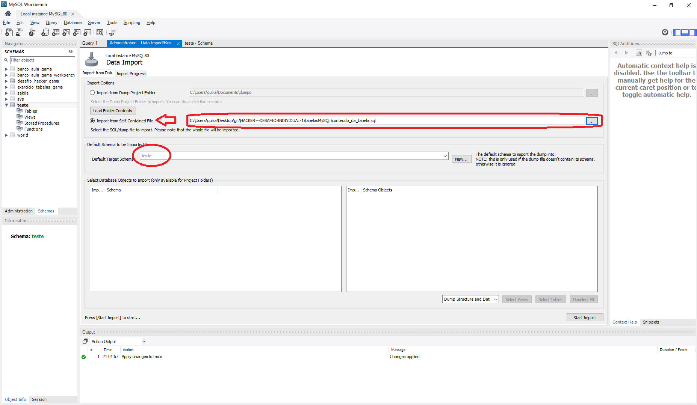

<b><h1>Desafio Hacker Gama parte 3</b></h1>
<h2>Relação de arquivos:</h2>

estrutura_da_tabela.sql -> Contém todas as instruções para importar a estrutura da tabela para o mysql workbench ou qualquer outra ferramenta.   

conteudo_da_tabela.sql -> Contém todos os dados que foram inseridos manualmente na tabela para teste das querys solicitadas.   

consultas.sql -> Contém as 5 querys que foram pedidos para o teste, que são eles:

    1 consulta contemplando contagem ou totalização

    1 consulta contemplando a junção entre 2 tabelas

    1 consulta contemplando a junção entre 3 tabelas

    1 consulta contemplando a junção entre 2 tabelas + uma operação de totalização e agrupamento

    1 consulta contemplando a junção entre 3 ou mais tabelas + uma operação de totalização e agrupamento

<h1>Como importar os dados para o MySQL workbench</h1>
<h2>Importando a estrutura da tabela</h2>

1 - No MySQL workbench clique na sua base de dados para teste

2 - Selecione a opção 'Server' e depois 'Data Import'

3 - Selecione a opção 'Import from Self-Contained File', escolha o caminho do arquivo "estrutura_da_tabela.sql" e depois escolha em qual Esquema você quer utilizar a estrutura (eu utilizei uma tabela teste como está marcado na figura)

4 - Clique em 'Start Import' e pronto, seu esquema de dados já esta com todas as tabelas inseridas nele.

<h2>Importando os dados da tabela para teste</h2>

1 - Selecione a opção 'Import from Self-Contained File', escolha o caminho do arquivo "conteudo_da_tabela.sql" e depois escolha em qual Esquema você quer utilizar a estrutura (eu utilizei uma tabela teste como está marcado na figura)

2 - Clique em 'Start Import' e pronto, suas tabelas já estão com informações preenchidas para teste.

<h1>Arquivo com as consultas</h1>
O arquivo consultas.sql contém 5 consultas que fazem parte do exercicio, que são elas:
    
    1 - consulta contemplando contagem ou totalização - Contagem da tabela clientes.

                    select count(*) from clientes; 

    2 - consulta contemplando a junção entre 2 tabelas - Consulta da tabela de endereços relacionada com a tabela clientes.

                    select * from clientes
                    inner join enderecos
                    on clientes.id = enderecos.cliente
                    where clientes.id = 2;

    3 - consulta contemplando a junção entre 3 tabelas - Consulta junção entre tabelas: clientes - pedidos - produtospedido, de acordo com o número do pedido.

                    select nome, email, whatsapp, codigo as numero_pedido, data, pedidosstatus, descricao, precounitario , quantidade, precototal from clientes
                    inner join pedidos 
                    on clientes.id = pedidos.cliente
                    inner join produtospedido
                    on pedidos.id = produtospedido.pedidoid
                    where pedidos.id=1;

    4 - consulta contemplando a junção entre 2 tabelas + uma operação de totalização e agrupamento - Junção entre tabelas: produtos - estoque - departamento, somando o estoque e agrupando por departamento.

                    select departamentos.nome, sum(estoque.quantidade) as estoque_total from produtos
                    inner join departamentos
                    on produtos.departamento = departamentos.id
                    inner join estoque
                    on produtos.id = estoque.produtoid
                    group by departamento

    5 - consulta contemplando a junção entre 3 ou mais tabelas + uma operação de totalização e agrupamento - Junção entre tabelas: clientes - pedidos - produtospedido, somando a quantidade de itens e valor total agrupado por cliente.  

                    select clientes.id, nome, email, whatsapp, sum(quantidade) as itenscomprados, sum(quantidade*precounitario)as valortotal from clientes
                    inner join pedidos 
                    on clientes.id = pedidos.cliente
                    inner join produtospedido
                    on pedidos.id = produtospedido.pedidoid
                    group by clientes.nome

    

